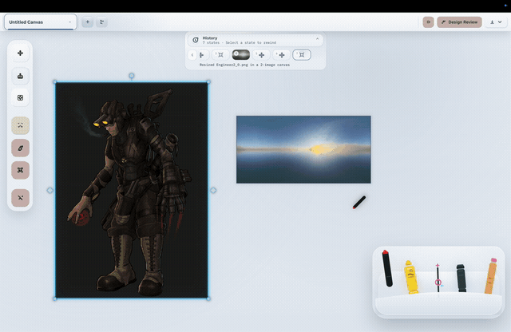

# Cue

Cue is an image-first desktop design workstation built around a text-free-first editing loop.

<p align="left">
  
</p>

The public launch slice is macOS-first and centers on:

- session tabs in one shared window
- image import and canvas editing
- design review proposals with in-place apply
- custom tool creation inside the app
- reproducible receipts and export

## Current Status

- Verified locally: macOS clone, tests, build, and DMG packaging
- Release target: macOS, Windows, and Linux parity for the same core workflow
- Public launch scope: source plus a macOS GitHub Release
- Not yet verified for public release: Windows and Linux packaging parity

## Run From Source

```bash
./scripts/dev_desktop.sh
```

## Release Check

```bash
./scripts/release_check.sh
```

That script runs desktop tests, frontend build, Rust checks, Tauri packaging, and DMG checksum output.

## Entry Points

- Product definition: [PRD.md](PRD.md)
- Contributor guide: [CONTRIBUTING.md](CONTRIBUTING.md)
- Maintainer release guide: [RELEASING.md](RELEASING.md)
- Agent rules: [AGENTS.md](AGENTS.md)
- Docs index: [docs/README.md](docs/README.md)
- Desktop behavior: [docs/desktop.md](docs/desktop.md)
- Legacy internals still in the tree: [docs/legacy-internals.md](docs/legacy-internals.md)
- Asset provenance decisions: [docs/asset-provenance.md](docs/asset-provenance.md)

## Known Limitations

- Current verification is strongest on macOS.
- PSD, PNG, JPG, WEBP, and TIFF exports are flattened in the current slice.
- Some internal crate names, resource names, and schema ids still use legacy `brood` or `juggernaut` naming while the public surface is standardized on Cue.

## License

Apache License 2.0. See [LICENSE](LICENSE).
