# Realtime Canvas: Slide-Ready User Benefit Story

## Single-Slide Visual (Drop Into PowerPoint)

SVG: `docs/assets/diagrams/realtime_canvas_user_benefits_story/one_slide_overview.svg`  
PNG: `docs/assets/diagrams/realtime_canvas_user_benefits_story/one_slide_overview.png`  
PPT-ready 16:9 PNG: `docs/assets/diagrams/realtime_canvas_user_benefits_story/one_slide_overview_16x9.png`  
Source: `docs/assets/diagrams/realtime_canvas_user_benefits_story/src/one_slide_overview.mmd`

## 10-Second Story

1. User edits images on canvas.
2. Brood captures what changed (layout + selection + short vision labels).
3. Brood proposes a better next step and generates with that context.
4. User gets a better first draft with fewer retries.

## Concrete Examples

- User resizes one image smaller: Brood captures scale change and preserves composition balance in the next draft.
- User selects two images and runs Bridge: Brood uses those exact two assets as the active intent pair.
- User drags subject left: Brood keeps the subject placement intent instead of recentralizing by default.
- User gets output: artifact, receipt, and cost/latency appear automatically for trust and debugging.

## Simplified Value Chain

SVG: `docs/assets/diagrams/realtime_canvas_user_benefits_story/value_chain.svg`  
PNG: `docs/assets/diagrams/realtime_canvas_user_benefits_story/value_chain.png`  
Source: `docs/assets/diagrams/realtime_canvas_user_benefits_story/src/value_chain.mmd`

## Circular Benefit Loop

SVG: `docs/assets/diagrams/realtime_canvas_user_benefits_story/benefit_flywheel.svg`  
PNG: `docs/assets/diagrams/realtime_canvas_user_benefits_story/benefit_flywheel.png`  
Source: `docs/assets/diagrams/realtime_canvas_user_benefits_story/src/benefit_flywheel.mmd`

## Slide Footer KPI Callouts

- Faster first accepted output.
- Higher first-pass adherence.
- Fewer retries per accepted output.
- Stable reproducibility via ordered events + receipts.
